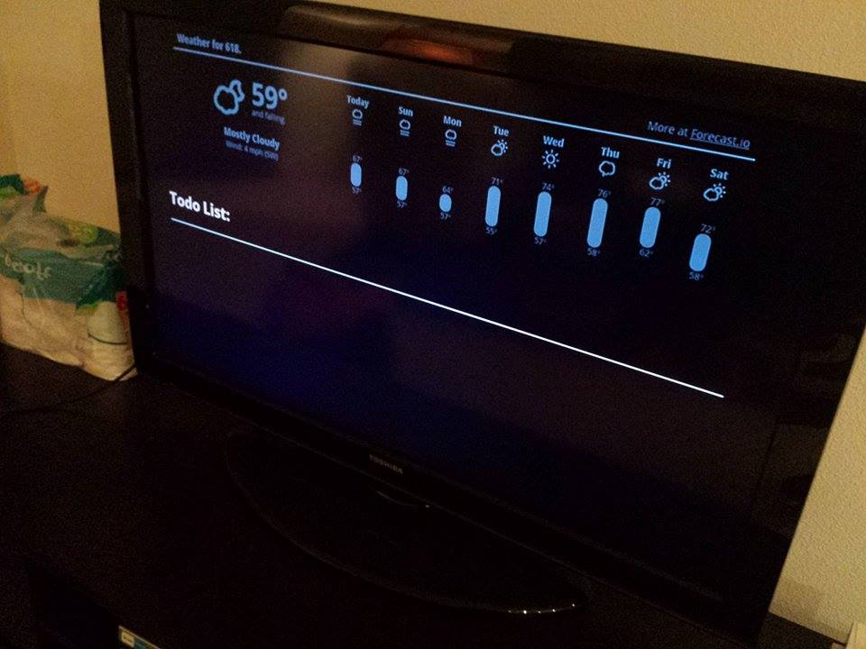

618Cast
=======

This is just a little experimentation with Chromecast development.   

### Purpose ###
The purpose of this small app is to provide the residents of apartment
618 with something meaningful to look at as their TV idles in their living
room. Thus, the weather is displayed (to encourage us to stay indoors)
and a task list is displayed.

### Installation ###
The installation of this is pretty simple. The `launcher.html` file serves
as the Chromecast Sender object while the `cast.html` file serves as 
the receiver. Both of these files can be hosted (locally or remotely) and then
plugged into the Chromecast development console for your own use

### Launching ###
The app can be launched on the Chromecast itself by navigating to the
`launcher.html` page and clicking on the button.
